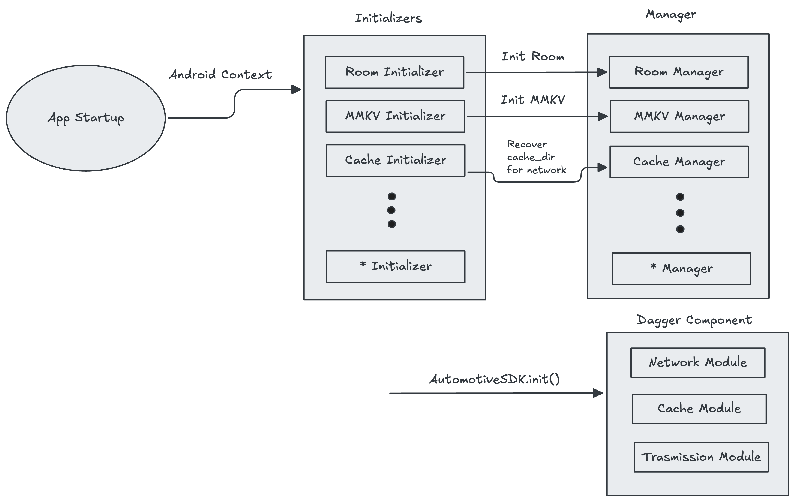

# Test Repository for Automotive-SDK

## Brief Description
test del workflow LOL

## Junit Env Variable
Set the following variable values in local.properties:

| Variable Name        | Description                              | Required           | Default |
|----------------------|------------------------------------------|--------------------|---------|
| RADIOPLAYER_USERNAME | Radioplayer username for Basic Http Auth | Only for Unit Test |         |
| RADIOPLAYER_PASSWORD | Radioplayer password for Basic Http Auth | Only for Unit Test |         |

## Product Flavor(s)
To add new product flavor, under `productFlavors` in build.gradle.kts create a new flavor.
Under `publishing` add a new `singleVariant`. Finally create  under `publications` a new MavenPublication

## Documentation
📄 [Gradle Tasks](docs/gradle-tasks.md)  
📄 [Kotlin-Java Interoperability Guide](docs/kotlin-java-interoperability.md)
📄 [Kotlin Documentation v1.11.0](docs/1.11.0/index.html)

## Initialization flow

## Contributing

Please see [CONTRIBUTING.md](./CONTRIBUTING.md) for guidelines on how to contribute.

## Code of Conduct

Please read our [Code of Conduct](./CODE_OF_CONDUCT.md) to help us maintain a welcoming community.

## Security

To report security issues, please check [SECURITY.md](./SECURITY.md).

